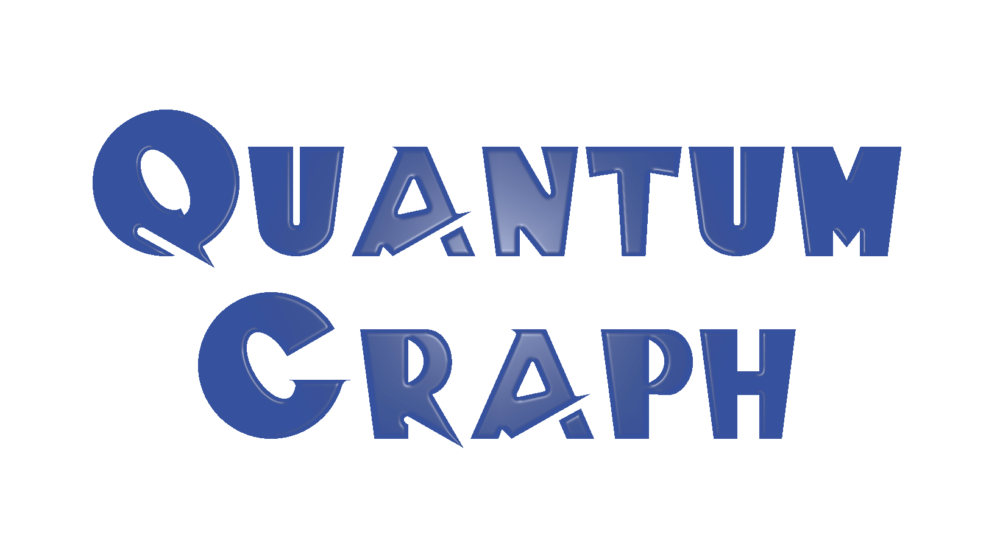

# QuantumGraph

## Development

Refer to [development](docs/development.md) for developing this QGIS3 plugin.

## License
This plugin is licenced with[GNU General Public License, version 3](https://www.gnu.org/licenses/gpl-3.0.html)

See [LICENSE](LICENSE) for more information.
